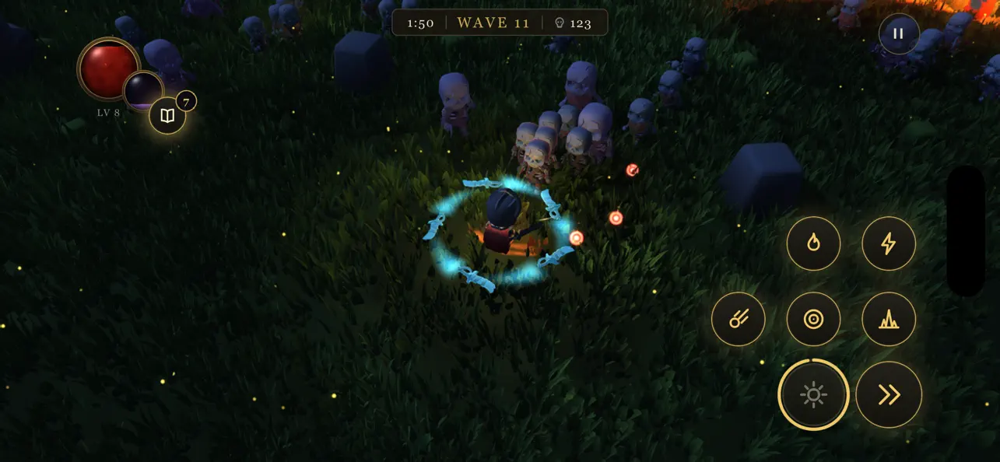
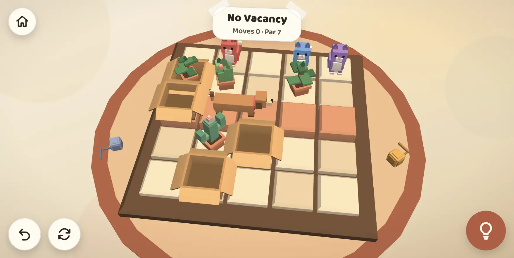
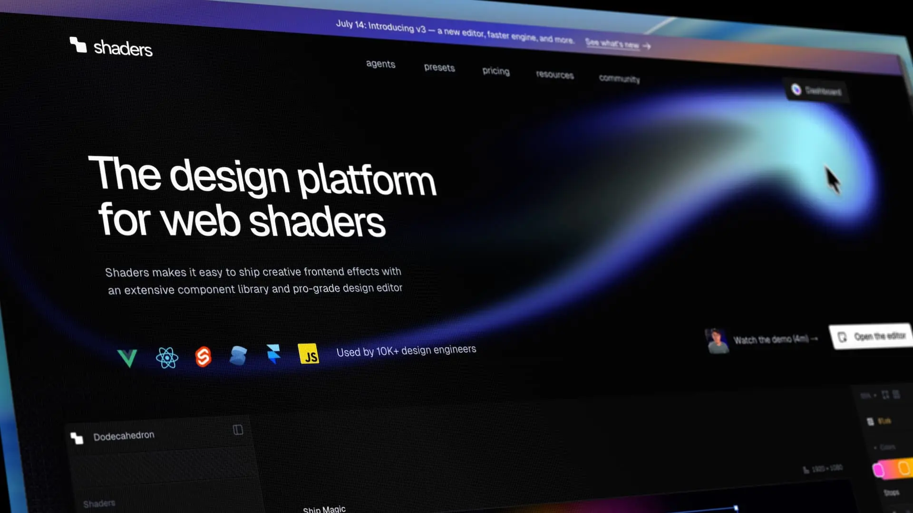

Hello fellow GPU enthusiast!

Over the past 2 months, my team and I have been working on making TypeGPU useful in more places, and making it disappear a little more once your app is ready to ship. TypeGPU resources can now cross React Native runtimes, shaders can be made considerably smaller, and our experimental WebGL backend can run real TypeGPU render pipelines.

We have also added lower-level command recording APIs, asynchronous pipeline initialization, and a handful of shader code improvements. There is quite a lot to unpack, so let's get into it!

- [New examples](#new-examples)
- [Built with TypeGPU 0.12](#built-with-typegpu-012)
- [Migration guide](#migration-guide)
- [TypeGPU on other runtimes](#typegpu-on-other-runtimes)
- [More control over GPU work](#more-control-over-gpu-work)
- [Smaller production shaders](#smaller-production-shaders)
- [Shader code ergonomics](#shader-code-ergonomics)
- [Better warnings](#better-warnings)
- [Ecosystem](#ecosystem)
- [What's next?](#whats-next)

## New examples

Our examples page has grown quite a bit since the last release post. There are five new demos that push TypeGPU in very different directions:

- ["Trippy Raymarching"](https://typegpu.com/examples/#example=rendering--trippy-raymarching) - an interactive, twisting tunnel of SDF spheres, complete with enough controls to make it uniquely yours.
- ["OS Awards"](https://typegpu.com/examples/#example=rendering--os-awards) - an interactive, physically based rendering of our Open Source Awards statuette.
- ["Selfie Segmentation"](https://typegpu.com/examples/#example=image-processing--selfie-segmentation) - real-time background replacement, with the entire inference and post-processing pipeline running in TypeGPU.
- ["Radiance Cascades"](https://typegpu.com/examples/#example=rendering--radiance-cascades) - a from-scratch implementation of real-time 2D global illumination.
- ["Radiance Cascades (with drawing)"](https://typegpu.com/examples/#example=rendering--radiance-cascades-drawing) - paint glowing shapes and watch light propagate through the scene, powered by the new `@typegpu/radiance-cascades` package.

The initial release of `@typegpu/react` also came with three smaller examples showing how TypeGPU resources fit into React components and hooks:

- ["React: Spinning Triangle"](https://typegpu.com/examples/#example=react--spinning-triangle)
- ["React: Shifting Gradient"](https://typegpu.com/examples/#example=react--shifting-gradient)
- ["React: Confetti"](https://typegpu.com/examples/#example=react--confetti)

And there are two new examples showing the progress of our experimental WebGL fallback:

- ["Triangle (WebGL fallback)"](https://typegpu.com/examples/#example=simple--triangle-gl) - the smallest possible proof that the same TypeGPU pipeline can target something other than WebGPU.
- ["Caustics (WebGL fallback)"](https://typegpu.com/examples/#example=rendering--caustics-gl) - a more demanding example combining uniforms, matrices, helper functions and `@typegpu/noise`.

The second one is particularly exciting. A fallback is only useful if it can render more than a triangle, and the caustics example is a nice first glimpse of where this work is heading.

## Built with TypeGPU

Examples are one thing, but this release cycle also brought two complete games powered by TypeGPU 0.12 to the web and app stores.

### Bone Tide

[](https://reczkok.github.io/typegpu-adventure/beta/)

[Bone Tide](https://x.com/reczko_konrad/status/2083514256423575753?s=20), created by my teammate Konrad Reczko [(@reczkok)](https://github.com/reczkok), is now available on the [App Store](https://apps.apple.com/pl/app/bone-tide-horde-survival/id6791994827), [Google Play](https://play.google.com/store/apps/details?id=com.swmansion.bonetide&hl=en) and [the web](https://reczkok.github.io/typegpu-adventure/beta/). It was written from scratch without an existing engine underneath, with both its game logic and shaders written in TypeScript. Its Expo app runs on the exact same TypeGPU engine as the web game, shared one-to-one between platforms, with only the UI ported to React.

### Purrkour

[](https://blazejkustra.github.io/purrkour/)

[Purrkour](https://apps.apple.com/pl/app/purrkour-cat-puzzle-game/id6793995936) is a cozy puzzle game by Błażej Kustra in which you help cats jump across compact living rooms and find their way into boxes. It is available on the [App Store](https://apps.apple.com/pl/app/purrkour-cat-puzzle-game/id6793995936) and [on the web](https://blazejkustra.github.io/purrkour/).

Seeing two very different games make the leap from experiments to something anyone can download and play is an exciting milestone for TypeGPU. Congratulations to both creators on their releases!

### Shaders v3



[Shaders](https://shaders.com/) has launched v3 with an entirely new rendering engine built directly on TypeGPU. According to their [release post](https://shaders.com/updates/introducing-shaders-v3), the new engine helped make production bundles 3× smaller on average and shader compilation up to 25× faster.

It's awesome to see TypeGPU being adopted by a tool used to ship WebGPU effects to thousands of production websites. Congratulations to the Shaders team on the release!

## Migration guide

This release removes a set of APIs that have been deprecated for a while, most notably the old pipeline builder, texture layout descriptors, `.value` and `layout.bound`.

We have prepared a detailed [Migrating to 0.12](/TypeGPU/migrations/0-12) guide with before-and-after snippets for each change.

## TypeGPU on other runtimes

### React Native Worklets

Per-frame work in a React Native app should not have to wait for unrelated work on the RN thread. With `react-native-worklets`, `@typegpu/react` can now run its `useFrame` callbacks on the UI thread.

```tsx
useFrame(({ elapsedSeconds }) => {
  'worklet';

  const context = ctxRef.current;
  if (!context) return;

  timeUniform.write(elapsedSeconds);
  pipeline.withColorAttachment({ view: context }).draw(3);
});
```

The tricky part was not moving the callback itself. It was making the resources captured by it usable on another JavaScript runtime. TypeGPU roots, buffers, textures, samplers, bind groups, layouts and pipelines can now be transferred while keeping the same underlying GPU objects and their identity.

If your app uses React Native, refer to the [React Native Worklets guide](/TypeGPU/integration/react-native/worklets/) for setup instructions and the rules around transferring resources.

### Experimental WebGL fallback

`@typegpu/gl` can generate GLSL and execute a subset of TypeGPU's render API on WebGL 2. You can try WebGPU first and fall back automatically with one function:

```ts
import { initWithGLFallback } from '@typegpu/gl';

const root = await initWithGLFallback();
```

This is still experimental and does not cover compute or the full TypeGPU API, but it can already run non-trivial render pipelines. The same work also lets TypeGPU functions used through `@typegpu/three` follow Three.js onto its WebGL backend.

[Read more about the supported API and manual GLSL generation in the `@typegpu/gl` guide.](/TypeGPU/ecosystem/typegpu-gl/)

## More control over GPU work

### Command encoders and passes

Calling `.draw()` or `.dispatchWorkgroups()` directly remains the simplest way to execute a pipeline. For cases where multiple operations should share one command buffer or render pass, TypeGPU now exposes typed command encoders and passes.

```ts
const encoder = root['~unstable'].createCommandEncoder();
const pass = encoder.beginRenderPass({
  colorAttachments: { view: context },
});

scenePipeline.with(pass).draw(sceneVertexCount);
overlayPipeline.with(pass).draw(overlayVertexCount);

pass.end();
encoder.submit();
```

The pass can be used from the pipeline-centric API, as above, or directly through familiar methods like `pass.setPipeline()`, `pass.setBindGroup()` and `pass.draw()`. TypeGPU keeps track of the state shared by both styles and only applies it when necessary.

[More about command encoders and passes in the Pipelines guide.](/TypeGPU/apis/pipelines/#command-encoders-and-passes)

### Asynchronous pipeline initialization

Pipelines are still initialized lazily on their first draw or dispatch. Larger applications can now move that work away from the first frame by initializing them ahead of time:

```ts
await Promise.all([
  simulationPipeline.initAsync(),
  scenePipeline.initAsync(),
  postProcessingPipeline.initAsync(),
]);
```

`initAsync()` uses WebGPU's asynchronous pipeline creation APIs and waits until compilation finishes on the device. There is also `initSync()` if you only want to eagerly perform the regular synchronous initialization.

For small and medium-sized shaders the difference will usually be negligible, so there is no need to initialize every pipeline manually.

### One kind of buffer binding

Until now, `root.createUniform(...)` and `buffer.as('uniform')` returned two subtly different kinds of objects. In 0.12 they are both buffer bindings, with the same read, write and shader access APIs.

This also means a shorthand binding can be passed directly to a matching bind group:

```ts
const size = root.createUniform(d.vec2u, d.vec2u(800, 600));
const layout = tgpu.bindGroupLayout({
  size: { uniform: d.vec2u },
});

const bindGroup = root.createBindGroup(layout, { size });
```

It is a small distinction to remove, but it makes buffers much easier to move between TypeGPU's fixed-resource and manual bind group APIs.

For type annotations, 0.12 also adds `TgpuUniformBuffer`, `TgpuStorageBuffer`, `TgpuVertexBuffer` and `TgpuIndexBuffer`. They replace verbose intersections between `TgpuBuffer` and individual usage flags.

## Smaller production shaders

Minifying JavaScript does not make the WGSL generated at runtime any smaller. TypeGPU 0.12 adds two experimental options aimed specifically at shader code.

The bundler plugin can shorten identifiers stored in shader metadata:

```ts
typegpu({
  autoNamingEnabled: false,
  unstable_obfuscate: true,
});
```

The runtime can then remove comments and redundant whitespace from the generated shader:

```ts
const root = await tgpu.init({ unstable_minify: true });
```

These options can be enabled independently, but together they turn this:

```wgsl
fn coneVolume(radius: f32, height: f32) -> f32 {
  let baseArea = 3.141592653589793f * pow(radius, 2f);
  let volume = baseArea * height / 3f;
  return volume;
}
```

into something closer to this:

```wgsl
fn item(a:f32,b:f32)->f32{let c=(3.141592653589793f*pow(a,2f));let e=((c*b)/3f);return e;}
```

Obfuscated errors are not fun to debug, so we strongly recommend enabling these options only for production builds. [The Minifying & Obfuscating Shaders guide](/TypeGPU/advanced/minifying-shaders/) covers the tradeoffs in more detail.

Alongside this, using the named `tgpu` export, flatter captured externals and an improved package build make it easier for regular JavaScript tree-shaking to remove TypeGPU code your app does not use.

## Shader code ergonomics

### A general-purpose bitcast

The new `std.bitcast` works on the CPU and the GPU, and supports scalars and vectors of equal byte size, including `f16` vectors.

```ts
const floatBits = std.bitcast(d.f32, d.u32)(1);
const packedHalfs = std.bitcast(d.vec2h, d.u32)(d.vec2h(0.5, 1));
```

The narrower `std.bitcastU32toF32` and `std.bitcastU32toI32` helpers are now deprecated in favor of this API.

### Private properties

Resources stored in private class properties can now be captured by shader functions. This makes it easier to keep reusable GPU modules properly encapsulated.

```ts
class Counter {
  #value = tgpu.const(d.u32, 1);

  increment = (n: number) => {
    'use gpu';
    return n + this.#value.$;
  };
}
```

### Knowing where code is used

`std.getShaderStage()` returns `'vertex'`, `'fragment'` or `'compute'` during shader generation. A helper can use it to specialize itself for every stage it is called from, in the same spirit as `std.getTargetShaderLanguage()`.

[More about resolution environment helpers in the Utils guide.](/TypeGPU/apis/utils/#resolution-environment)

## Better warnings

Warnings now include a category, making it easier to tell a precision loss from a missing WebGPU feature or an internal fallback. Less important warnings are also silenced in production by default.

If a warning is expected and cannot be addressed at its source, it can be disabled explicitly:

```ts
import { warn } from 'typegpu';

warn.disable('implicit-conversion');
```

Calling `warn.reset()` restores the defaults. Silencing a warning should remain the last resort, but now there is a precise escape hatch when you need one.

## Ecosystem

### TypeGPU for React

`@typegpu/react` brings TypeGPU resources into the React lifecycle, on both the web and React Native. Hooks such as `useRoot`, `useUniform`, `useBindGroup` and `useConfigureContext` take care of creating resources, sharing them between components and cleaning them up, while `useFrame` provides a natural place to update and draw every frame.

Values can stay on the GPU and be updated imperatively, or follow React state through `useMirroredUniform`. The package also integrates with Suspense while the root is being initialized, so loading and unsupported-device states fit into the rest of your component tree.

The three React examples mentioned above are a good place to see these pieces working together. For a guided introduction and the complete hook reference, head over to the [`@typegpu/react` guide](/TypeGPU/ecosystem/typegpu-react/).

### 2D global illumination with @typegpu/radiance-cascades

`@typegpu/radiance-cascades` packages a TypeGPU implementation of the Radiance Cascades technique for real-time 2D global illumination. You provide shader callbacks that describe the scene's signed distance field and surface colors; the package owns the cascade textures and dispatches the compute passes needed to produce a radiance field.

It pairs particularly well with `@typegpu/sdf`: draw a scene into a texture, turn it into a signed distance field with jump flooding, and feed the result into the radiance runner. That is exactly how the interactive ["Radiance Cascades (with drawing)"](https://typegpu.com/examples/#example=rendering--radiance-cascades-drawing) demo lets light react immediately to every brush stroke.

The [`@typegpu/radiance-cascades` guide](/TypeGPU/ecosystem/typegpu-radiance-cascades/) covers the basic setup, generated SDF textures, custom ray marching and output configuration.

### Better pseudo-random numbers in @typegpu/noise

`@typegpu/noise` now uses `Xoroshiro64**` as its default pseudo-random number generator. It has a 64-bit state, works on both the CPU and GPU, and produces substantially better distributions than the previous default.

The package also exports the generator as `XOROSHIRO64STARSTAR`, a new `LCG32` implementation, and utilities for hashing and scrambling seeds. If your app depends on the exact sequence produced by the old generator, the [migration guide](/TypeGPU/migrations/0-12/#new-pseudo-random-number-generator-in-typegpunoise) includes a compatible implementation.

## What's next?

There are many more things introduced in TypeGPU 0.12 that I haven't mentioned. If you're curious about the full list of changes made in TypeGPU 0.12, you can
read [the full 0.12.0 diff](https://github.com/software-mansion/TypeGPU/compare/v0.11.9...v0.12.0).
