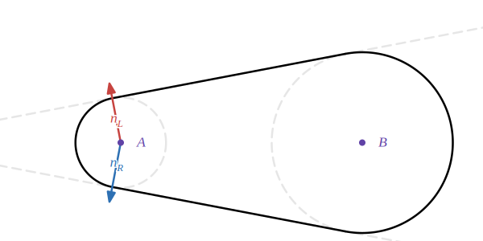
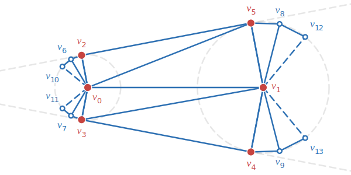

# Variable Width Line Rendering

by @deluksic

High quality line rendering is a basic need in many graphics applications.
Charts, maps, graphs, particle systems, scientific visualizations, you name it.
Unfortunately, a high quality line primitive is not available in most graphics
APIs, especially low-level ones like WebGPU. You might think "I will slap
`topology: 'line-strip'` and be done with it". However, this primitive is very
limited. It allows only single pixel width lines! Good for debugging, but
terrible for anything user-facing. With TypeGPU, it is easier than ever to
create reusable, composable libraries. And now, high quality line rendering is
just an `npm install` away! This article serves as documentation for the library
source code. It should also give you an appreciation for how complex line
rendering can actually get.

## Goals

As already described in many online articles, drawing lines using GPU can be
notoriously difficult to do well. There are many different, sometimes
conflicting, goals you might have when it comes to line rendering. Following
goals are considered by this article and implementation:

|                                                |                                                                                                                                                                                                         |
| ---------------------------------------------- | ------------------------------------------------------------------------------------------------------------------------------------------------------------------------------------------------------- |
| Variable width                                 | Line width can be specified per-vertex. This is a core goal which complicates the math quite a bit, and forces us to have 4 triangles per-segment. But it makes the implementation elegant and general. |
| Joins, caps                                    | Ability to choose how to join and cap off segments. Separate start and end caps.                                                                                                                        |
| Minimal overlaps                               | When rendering transparent lines, we should avoid producing overlaps which cause doubling-up.                                                                                                           |
| Single draw call                               | Having the ability to do everything (caps, joins, segment) in one draw call makes using the library very easy.                                                                                          |
| Coloring based on contour level sets           |                                                                                                                                                                                                         |
| Coloring based on distance along line (dashes) |                                                                                                                                                                                                         |
| Half-fill                                      | When rendering outlines, you might want to render only one half of the line in order to avoid covering the content of what is outlined.                                                                 |

### Non-goals

- maximum performance
- triangle counts
- minimizing quad-overdraw (having max-area triangles)

## Single Line Segment

We start with a single segment. Two vertices, `C1` and `C2` (C for center), and
radii `r1` and `r2`.



Two most important directions to compute are `nL` and `nR`, left (CCW) and right
(CW) external tangent **normals**.

```ts
x = (r1 - r2) / distance(C1, C2);
y = sqrt(1 - x ^ 2);
nL = vec2(x, y);
nR = vec2(x, -y);
```

NOTE: in `externalNormals.ts`, additional care is taken to return `nL` and `nR`
rotated relative to the `distance` vector between the circles.

Using these two directions, it is trivial to compute all other points necessary
for triangulation:



**Core** (red) vertices 0-5 are:

```ts
v0 = C1;
v1 = C2;
v2 = C1 + r1 * nL;
v3 = C1 + r1 * nR;
v4 = C2 + r2 * nR;
v5 = C2 + r2 * nL;
```

Vertices 6+ are called `join` vertices in the code, however they are used for
both `joins` and `caps`. Their computation will depend on the type of `join` or
`cap` used. Here, a `round` cap is shown. It is important to note their
distribution. Just like the 4 core vertices 2-5, they are distributed CCW
progressively further away from their respective core vertex. This makes it
possible to dynamically vary the number of segments in the joins, while using
the same index buffer. Each join vertex is identified by:

- `coreVertexIndex` which core vertex it belongs to (`v2,v6,v10=0`,
  `v3,v7,v11=1` etc.)
- `joinVertexIndex` number of vertices away from the core vertex (`v2=0`,
  `v6=1`, `v10=2`)

```ts
coreVertexIndex = (vertexIndex - 2) % 4;
joinVertexIndex = (vertexIndex - 2) / 4;
```

NOTE: instead of the slow `% 4` and `/ 4`, real code uses `& 0b11` and `>> 2`.
Probably can be optimized away by wgsl compilers, but you never know.

Cap functions can then use `joinVertexIndex` and `maxJoinCount` to compute the
final position of each join vertex.

If all you want to do is render single line segments, you should use
`singleLineSegmentVariableWidth(A, B)` function. It does exactly what we just
discussed and nothing more.

## Joining Line Segments

Easy part is done. Joining segments is where the difficulties and edge cases
start. First, lets consider how in theory the joining should work:
