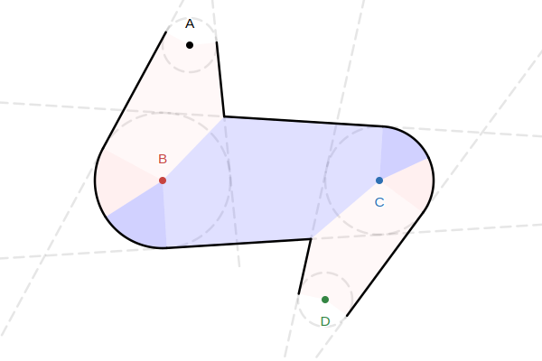

# Variable Width Line Rendering

by @deluksic

High quality line rendering is a basic need in many graphics applications.
Charts, maps, graphs, particle systems, scientific visualizations, you name it.
Unfortunately, a high quality line primitive is not available in most graphics
APIs, especially low-level ones like WebGPU. You might think "I will slap
`topology: 'line-strip'` and be done with it". However, this primitive is very
limited. It allows only single pixel width lines! Good for debugging, but
terrible for anything user-facing. With TypeGPU, it is easier than ever to
create reusable, composable libraries. And now, high quality line rendering is
just an `npm install` away! This article serves as documentation for the library
source code. It should also give you an appreciation for just how complex line
rendering can get!

## Goals

As already described in many online articles, drawing lines using GPU can be
quite involved. There are many different, sometimes
conflicting, goals you might have when it comes to line rendering. Following
goals are considered by this article and implementation:

|                                                |                                                                                                                                                                                                         |
| ---------------------------------------------- | ------------------------------------------------------------------------------------------------------------------------------------------------------------------------------------------------------- |
| Variable width                                 | Line width can be specified per-vertex. This is a core goal which complicates the math quite a bit, and forces us to have 4 triangles per-segment. But it makes the implementation elegant and general. |
| Joins, caps                                    | Ability to choose how to join and cap off segments. Separate start and end caps.                                                                                                                        |
| Minimal overlaps                               | When rendering transparent lines, we should avoid producing overlaps which cause doubling-up.                                                                                                           |
| Single draw call                               | Having the ability to do everything (caps, joins, segment) in one draw call makes using the library very easy.                                                                                          |
| Coloring based on contour level sets           |                                                                                                                                                                                                         |
| Coloring based on distance along line (dashes) |                                                                                                                                                                                                         |
| Half-fill                                      | When rendering outlines, you might want to render only one half of the line in order to avoid covering the content of what is outlined.                                                                 |

### Non-goals

- maximum performance
- minimizing triangle counts
- minimizing quad-overdraw (producing max-area triangles)

## Single Line

We start with a single line. Two control points, $A$ and $B$ with
radii $r_A$ and $r_B$.


Two most important directions to compute are $\hat{n_L}$ and $\hat{n_R}$, left (CCW) and right
(CW) external tangent **normals** (with respect to $\vec{AB}$).

```math
x = \frac{r1 - r2}{\|{AB}\|} \\
y = \sqrt{1 - x ^ 2} \\
\hat{n_L} = (x, y) \\
\hat{n_R} = (x, -y)
```

NOTE: in `externalNormals.ts`, additional care is taken to return $\hat{n_L}$ and $\hat{n_R}$
rotated relative to $\vec{AB}$.

Using these two directions, it is trivial to compute all other points necessary
for triangulation:


**Core** 🔴 vertices 0-5 are:

```math
{\color{red} v_0} = A \\
{\color{red} v_1} = B \\
{\color{red} v_2} = A + r_A n_L \\
{\color{red} v_3} = A + r_A n_R \\
{\color{red} v_4} = B + r_B n_R \\
{\color{red} v_5} = B + r_B n_L
```

Vertices 6+ are called `join` vertices in the code, but they are used for
both `joins` and `caps`. Their computation will depend on the type of `join` or
`cap` used. Here, an (incomplete) `round` cap is shown. It is important to note their
distribution. Just like the 4 core vertices 2-5, they are distributed CCW
progressively further away from their respective core vertex. This makes it
possible to dynamically vary the number of segments in the joins, while using
the same index buffer. Each join vertex is identified by:

- `coreVertexIndex` which core vertex it belongs to
- `joinVertexIndex` number of vertices away from the core vertex

```ts
const coreVertexIndex = (vertexIndex - 2) % 4;
const joinVertexIndex = (vertexIndex - 2) / 4;
```

NOTE: real code uses `& 0b11` and `>> 2` instead of div.

Cap functions can then use `joinVertexIndex / MAX_JOIN_COUNT` to compute the
final position of each join vertex.

If all you want to do is render single line segments, you should use
`lineVariableWidth(A, B, vertexIndex, MAX_JOIN_COUNT)` function. It does exactly what we just
discussed and nothing more.

## Polylines

Easy part is done. Joining segments into polylines is what makes line rendering interesting! First, lets consider how in theory the joining should work. A polyline consists of many joined segments. Each segment's geometry depends on its two neighboring segments. This is why the function accepts 4 consecutive control points $A, B, C, D$ with radii $r_A, r_B, r_C, r_D$.



The segment that actually gets drawn is $BC$, shaded in $\color{blue} blue$. The function needs $A$ and $D$ in order to compute the join geometry, but it does not create the red shaded regions. Darker shaded regions highlight the join area. Notice that only half the join is handled by each segment.